<div align="center">
  <picture>
    <source media="(prefers-color-scheme: dark)" srcset="assets/hero-dark.svg">
    
  </picture>
  
</div>

## 👋 안녕하세요!
🧩 문제 해결을 즐기는 AI 풀스택 개발자 조창래입니다.

Java · Spring 으로 다진 **구조와 기본기** 위에 FastAPI · LangGraph 로 AI를 얹고,
React · Next.js 로 화면까지 붙여 **기획부터 배포까지 혼자서도 끝을 봅니다.**

최근에는 **경로 탐색·비용 최적화**, **실시간 영상/신호 기반 추론**, **위치·공간 데이터 처리** 등
AI가 실제 환경에서 판단 근거를 설명하며 동작하는 문제에 집중하고 있습니다.

---

<picture>
  <source media="(prefers-color-scheme: dark)" srcset="assets/sec-awards-dark.svg">
  
</picture>

<div align="center">
  <picture>
    <source media="(prefers-color-scheme: dark)" srcset="assets/awards-dark.svg">
    
  </picture>
</div>

### 🏅 K-해양 AI 챌린지 부산 2025 | 한국마이크로소프트 대표상 (우수상)

> 주최: 산업통상자원부 (2025 지역혁신클러스터육성 비R&D 사업 연계) · 팀: PolariX

- **친환경 북극항로 탐색 XAI(설명가능 AI) 모델**로 출품하여 **한국마이크로소프트 대표상(우수상)** 수상
- 연료·블랙카본·규제 위험 요소를 **하나의 비용 체계로 통합**해 친환경 북극항로를 탐색
- 경로 선택의 근거를 설명 가능한 방식으로 제공 → 안전성·환경성·정책 대응력을 종합 고려
- **경로 계획(Path Planning) + 다중 비용 최적화 + XAI** 를 해양 도메인에 적용한 사례

🔗 관련 기사 https://news.unn.net/news/articleView.html?idxno=587339

### 🥉 2026 K-Hackathon for Global | 우수상 (3위)

> 주최: 한국컴퓨터정보학회 · 국내 22개 대학 + 키르기스스탄 대학 참가

- 현장 관리직·근로자용 웹/앱 정보시스템 **「워플(WorkPle)」** 로 출품하여 **우수상(3위)** 수상
- ERP 기반 정보시스템 구축 과제 — 교육 직후 **24시간 내 기획 → 설계 → 구현 전 과정 완수**
- 실시간 업무 지시·수행 현황 공유를 목표로 매장 단위 WebSocket 채널 설계

🔗 관련 기사 https://www.mt.co.kr/policy/2026/07/14/2026071417263851653
🔗 관련 기사 https://www.seoul.co.kr/news/society/2026/07/14/20260714500209

### 🥈 2026 티슈(Tishoo) 해커톤형 팀업 공모전 | 우수상 (2등)

> 주최: Tishoo · 기간: 2026.02 ~ 2026.04 · 팀: BENEPICKER

- **위치 정보 기반 실시간 혜택 정보 플랫폼 「BenePicker」** 로 출품하여 **우수상(2등)** 수상
- GPS · **지오펜싱(반경 50m)** 기반 실시간 알림 구현
- MVP 개발 완료 및 **실서비스 배포**까지 완주
- 56명 대상 현장 인터뷰를 통한 시장 수요 검증
  (사용 의사 90% / 가맹점 제휴 의사 80% 확인)

🔗 관련 기사 https://www.sisunnews.co.kr/news/articleView.html?idxno=238213

---

<picture>
  <source media="(prefers-color-scheme: dark)" srcset="assets/sec-focus-dark.svg">
  
</picture>

<div align="center">
  <picture>
    <source media="(prefers-color-scheme: dark)" srcset="assets/focus-dark.svg">
    
  </picture>
</div>

> AI · 실시간 인식 · 자율주행 인접 영역에서, 지금까지의 프로젝트가 닿아 있는 지점입니다.

| 영역 | 관련 경험 | 프로젝트 |
|---|---|---|
| **경로 계획 · 비용 최적화** | 연료·블랙카본·규제 위험을 단일 비용 체계로 통합한 경로 탐색, XAI 기반 선택 근거 제시 | K-해양 AI 챌린지 |
| **실시간 영상 기반 추론** | MediaPipe 랜드마크 트래킹, 105차원 특징 벡터 포즈 판정, 저조도·역광 영상 전처리, 프레임 예산(33ms) 기준 성능 측정 | KB Motion Flow · MindController |
| **신호 처리 · 필터링** | rPPG(POS 기반) 심박 추정, 다중 프레임 중앙값 템플릿, 히스테리시스 게이팅, 시간 축 유예/유지 판정 | MindController · KB Motion Flow |
| **위치 · 공간 데이터** | PostGIS 공간 인덱스(`ST_DWithin`), 지오펜싱 반경 알림, 실시간 공공데이터 노드 필터링 | PedalRo · BenePicker |
| **엣지 · 온디바이스** | WASM 온디바이스 추론으로 서버 전송 없이 브라우저에서 영상·생체신호 처리 | MindController |
| **에이전트 · RAG** | LangGraph 오케스트레이션, pgvector 벡터 검색, LangChain LCEL 체이닝 + RAG 환각 방지 | Javis · PedalRo |

---

<picture>
  <source media="(prefers-color-scheme: dark)" srcset="assets/sec-projects-dark.svg">
  
</picture>

<div align="center">
  
  <picture>
    <source media="(prefers-color-scheme: dark)" srcset="assets/projects-dark.svg">
    
  </picture>
</div>

| 프로젝트 | 한 줄 소개 | 담당 | 링크 |
|---|---|---|---|
| **[KB Motion Flow](#-kb-motion-flow--손동작-기반-금융-접근성-ai-모듈)** | 손동작을 금융 화면 action 이벤트로 바꾸는 AI 인식 모듈 | AI 모듈 · 아키텍처 분리 | [AI](https://github.com/KB-AI-Challenge2026/KB-AI-Challenge-2026) · [BE](https://github.com/KB-AI-Challenge2026/KB-AI-Challenge-2026-BE) · [FE](https://github.com/KB-AI-Challenge2026/KB-AI-Challenge-2026-FE) |
| **[워플 (WorkPle)](#-워플-workple--현장-업무-관리-정보시스템)** | 현장 관리직·근로자용 업무 지시/수행 정보시스템 (🏆 우수상) | 프론트엔드 · 실시간 채널 | [GitHub](https://github.com/clae-dev/weple) |
| **[Javis](#-javis-자비스--개인용-ai-비서)** | FastAPI · LangGraph 기반 개인 AI 비서 | 풀스택 단독 | [GitHub](https://github.com/clae-dev/javis) |
| **[MindController](#-mindcontroller--웹-기반-표정심박-감정-분석-서비스)** | 웹캠 표정·심박(rPPG) 감정 분석 | 단독 개발 | [Live](https://mindcontroller-theta.vercel.app) · [GitHub](https://github.com/clae-dev/MindController) |
| **[혼디 (HONDI)](#-혼디-hondi--제주-혼행-커뮤니티-플랫폼)** | 제주 혼행 동행 매칭 커뮤니티 (파이널 프로젝트) | 풀스택 1인 | [Live](https://hondi.site) |
| **[BenePicker](#-benepicker--위치-기반-혜택-큐레이션-서비스)** | 위치 기반 혜택 큐레이션 (🏆 우수상) | 백엔드 · 배포 | [Live](https://bene-picker.vercel.app) |
| **[SIMVEX](#-simvex--3d-공학-학습-플랫폼-해커톤-mvp)** | 3D 기계 부품 시각화 학습 플랫폼 | 백엔드 · 인증/DB | [GitHub](https://github.com/Blaybus-TED-Chang/simvex-web) |
| **[성분핏](#-성분핏-ingredientfit--전성분-기반-화장품-큐레이션)** | 전성분 배치 순서로 가성비를 계산하는 큐레이션 | AI · 백엔드 | [GitHub](https://github.com/HYCU-beauty-project/seongbunfit) |
| **[SeoulMate](#-seoulmate--영상-분석-기반-서울-여행-코스-어시스턴트)** | 영상 속 장소 인식 + 혼잡도 반영 동선 생성 | 백엔드(NestJS) | [GitHub](https://github.com/PrincessDiary/SeoulMate) |
| **[RE:LAY](#-relay--예약형-리필-구독-프로토타입)** | 정기배송 대신 예약형 리필 + 합배송 컨셉 검증 | 단독 개발 | [Live](https://relay-plum-eta.vercel.app) · [GitHub](https://github.com/clae-dev/relay) |
| **[ESTAID](#-estaid--ai-기반-2차-창작-컨텐츠-생성-플랫폼)** | 플롯→이미지→영상 자동화 AI 플랫폼 | 백엔드 도메인 설계 | — |
| **[PedalRo](#-pedalro-페달로--ai-자전거-관광-코스-큐레이션)** | 공영자전거 실시간 데이터 기반 코스 추천 | 백엔드 · LLM 체이닝 | [GitHub](https://github.com/clae-dev/PedalRo) |
| **[Signal](#-signal--마케팅-실무자용-키워드-추적-플랫폼)** | 키워드 변화 추적 & AI 분석 대시보드 | 풀스택 | — |
| **[성 빈첸시오 청년회 커뮤니티](#-성-빈첸시오-청년회-커뮤니티--실운영-단체-웹사이트)** | 회원·게시판·일정 통합 단체 웹사이트 | 풀스택 · 레거시 이관 | — |

---

## 🖐️ KB Motion Flow | 손동작 기반 금융 접근성 AI 모듈

> 제8회 KB A.I Challenge 2026 출품 · _손짓 하나로, 금융을 더 쉽게_

웹캠에 비친 손동작을 금융 화면이 바로 쓸 수 있는 **action 이벤트**로 바꾸는 AI 인식 모듈

### 📌 프로젝트 개요

- 사용자가 **직접 정한 손동작**에 원하는 금융 업무를 연결 → 포즈 유지만으로 해당 화면 호출
- 손바닥을 편 채 유지하면 **Easy 도움 모드** 호출 (`Open_Palm` 0.7초 유지 확정)
- **AI는 화면을 열지 않습니다.** 손동작을 판정해 `action` 이벤트만 발행하고, 화면 전환은 BE/FE가 담당

### 🧠 Architecture Overview

```
AI 모듈 (본 저장소)                 Backend               Frontend
웹캠 → 영상 전처리 → MediaPipe  →  이벤트 브로커     →   action 라우팅
      → 포즈 판정(105차원 특징)     (HTTP · WebSocket)     금융 화면 전환
```

| 저장소 | 역할 |
|---|---|
| [AI](https://github.com/KB-AI-Challenge2026/KB-AI-Challenge-2026) | 손동작 인식 · action 이벤트 발행 |
| [BE](https://github.com/KB-AI-Challenge2026/KB-AI-Challenge-2026-BE) | 이벤트 수신 · 브로커 · 업무 처리 |
| [FE](https://github.com/KB-AI-Challenge2026/KB-AI-Challenge-2026-FE) | action 라우팅 · 금융 화면 |

### 🔍 담당 역할 & 기여도

- **카메라 단일 소유권** 원칙으로 AI/BE/FE 3-저장소 아키텍처 및 연동 계약(`event_schema`) 설계
- 관절 좌표 + 각도 + 거리 + 방향을 묶은 **105차원 특징 벡터** 기반 포즈 유사도 판정 구현
- 저조도·역광 대응 영상 전처리(감마 LUT → CLAHE(LAB L채널) → bilateral) 및 밝기 히스테리시스 게이팅
- 오작동 방지 7단계 보정 — 좌우 손 다수결 확정 · 중앙값 템플릿 · 항목별 임계값 동시 통과 · 쿨다운/해제 확인
- 카메라 없이 순수 계산 비용을 재는 **벤치마크 하네스** 작성 후 측정 기반 최적화 판단

### 📈 측정 & 판단

- 등록 포즈 5개 기준 프레임당 판정 비용 **638 µs** = 30fps 예산(33ms)의 **1.9%** → 판정 로직은 병목이 아님
- 진짜 지렛대였던 **캡처 해상도 고정(640×480)** 만 적용 (전처리·추론 비용은 픽셀 수에 정비례)
- 벡터화(2.7배)·중복 계산 제거(최대 72%)는 개선폭까지 확인했으나 **정확도 회귀 위험 대비 이득이 작아 보류**

### 🛠 Tech Stack

Python 3.10~3.12 · MediaPipe Tasks Vision · OpenCV · NumPy · unittest

---

## 🧰 워플 (WorkPle) | 현장 업무 관리 정보시스템

> 🏆 2026 K-Hackathon for Global **우수상(3위)** · 주최: 한국컴퓨터정보학회
> _교육 직후 24시간 안에 기획 → 설계 → 구현까지_

현장 관리직과 근로자가 **업무 지시 · 수행 · 확인**을 같은 화면에서 주고받는 웹/앱 정보시스템

### 📌 프로젝트 개요

- **오픈보드** — 매장 단위 업무 보드에서 태스크 생성 · 담당자 배정 · 처리 이력 확인
- **직원 관리 / 스케줄** — 직원 목록·상세, 근무 일정 확인
- **재고 · 리포트** — 재고 현황 관리 및 기간별 업무 리포트
- **초대 링크 기반 합류** — 로그인 → 매장 선택 → 오픈보드 초대 플로우
- 모바일 우선 화면 + PWA 설치 지원

### 🔍 담당 역할 & 기여도

- React 19 + Vite + TypeScript 기반 프론트엔드 구현 (13개 화면 라우팅)
- **매장 채널 WebSocket 연결** 설계 — 지수 백오프 재연결(1→2→4→8초, 최대 30초)
- 연결 실패 시 **TanStack Query 폴링으로 자동 폴백**해 실시간성이 끊겨도 화면이 멈추지 않도록 구성
- JWT 자동 첨부 · 표준 오류(`ApiError`) 처리를 담당하는 얇은 fetch 래퍼 작성
- Docker + nginx 정적 서빙 설정 및 Vercel SPA 리라이트 배포 구성

### 🛠 Tech Stack

React 19 · TypeScript · Vite · TanStack Query · React Router v7 · Framer Motion · WebSocket · PWA(vite-plugin-pwa) · Docker · Nginx · Vercel

🔗 GitHub
https://github.com/clae-dev/weple

---

## 🚀 Javis (자비스) | 개인용 AI 비서

> _매일 쓰려고 만든 물건이라, 화려한 기능보다 안 끊기고 · 빠르고 · 믿을 수 있는 것을 먼저 챙겼다_

FastAPI · LangGraph 기반의 풀스택 개인 AI 비서 서비스

### 📌 프로젝트 개요

- **대화** — WebSocket 기반 실시간 스트리밍 응답
- **장기 기억** — pgvector 벡터 임베딩으로 과거 대화 학습 및 컨텍스트 활용
- **음성** — Whisper 기반 음성 인식(STT) 및 TTS 응답
- **캘린더/Gmail 연동** — Google API로 일정 조회·생성, 메일 송수신
- **웹 검색** — Tavily 연동 (무료 폴백 지원)
- **리마인더 & 능동 알림** — 등록/조회/완료, 마감 리마인더·아침 브리핑 자동 전달
- **PWA** — 브라우저 설치형 앱 지원

### 🧠 Architecture Overview

```
PWA Client (JS / HTML / CSS)
        ↓ (WebSocket 스트리밍)
FastAPI + LangGraph (Agent Orchestration)
        ↓
PostgreSQL + pgvector (장기 기억)  ·  APScheduler (능동 알림)
        ↓
OpenAI (gpt-4o / Whisper / TTS)  ·  Google Calendar/Gmail  ·  Tavily Search
```

### 🔍 담당 역할 & 기여도

- 단일 개발자 풀스택 프로젝트 — 전체 설계·구현 담당
- LangGraph 기반 에이전트 오케스트레이션 설계
- pgvector 벡터 검색 기반 장기 기억 파이프라인 구현
- WebSocket 스트리밍 응답 및 음성(STT/TTS) 처리 흐름 구성
- Google Calendar/Gmail · Tavily 등 외부 API 연동
- APScheduler 기반 리마인더 / 능동 알림(아침 브리핑) 구현
- Docker · Docker Compose 기반 배포 환경 구성

### 🛠 Tech Stack

FastAPI · LangGraph · PostgreSQL + pgvector · OpenAI(gpt-4o / Whisper / TTS) · Google API · Tavily · APScheduler · PWA · Docker

🔗 GitHub
https://github.com/clae-dev/javis

---

## 🚀 MindController | 웹 기반 표정·심박 감정 분석 서비스

> _마음 들여다보기 — 웹캠 한 번으로 보는 나의 감정과 긴장도_

청소년 행사·부스 체험용으로 제작한 브라우저 기반 표정/심박 분석 서비스
(운영: 성빈센트청소년회 · 한국사회공헌협회 청년챔프단 Butterfly)

### 📌 프로젝트 개요

**🌿 마음 분석 모드**
- 얼굴 인식 시 **자동 10초 표정 분석** 진행
- MediaPipe 블렌드셰이프 기반 **7가지 감정 인식**(행복·슬픔·분노·놀람·평온·불쾌·불안)
- 웹캠으로 이마·볼의 미세 맥동을 분석하는 **rPPG 심박수 추정(BPM)**
- 감정 조합 기반 **스트레스 지수(0~100)** 및 3단계 판정
- 감정 분포 차트 · 맞춤 조언 · "오늘의 한마디"(명언/속담 50여 개) 제공
- 기기별 누적 통계로 분포 기반 판정 **자동 보정**

**🔍 긴장 감지 모드**
- 4초간 평소 표정을 학습하는 **베이스라인 학습**
- 실시간 긴장도 게이지(0~100) · 질문별 긴장도 비교 챌린지
- Duchenne 미소 기준 **진짜/억지 웃음 판별**
- 표정 긴장·미세표정·깜빡임·시선/고개 움직임·심박 상승을 통합한 **다중 신호 종합 분석**

### 🔒 설계 포인트

- 영상은 **브라우저 내에서만 처리**되며 서버로 전송되지 않음 (프라이버시 보호)
- MediaPipe WASM 기반 **온디바이스 추론**으로 별도 서버 추론 불필요
- `components` / `services` / `hooks` / `utils` 모듈 분리 구조

### 🔍 담당 역할 & 기여도

- 단독 개발 프로젝트 — 기획부터 구현·배포까지 전체 담당
- MediaPipe FaceLandmarker 기반 표정/블렌드셰이프 분석 로직 구현
- rPPG(POS 기반) 심박수 추정 및 스트레스 지수 산출 알고리즘 설계
- 베이스라인 학습 · 다중 신호 종합 기반 긴장 감지 모드 구현
- 기기별 누적 통계 기반 분포 보정 로직 설계
- Vercel 자동 배포 및 온디바이스 처리 구조 구성

### 🛠 Tech Stack

React 19 · TypeScript · Vite · MediaPipe FaceLandmarker(WASM) · rPPG(POS 기반) · Lottie · Vercel

🔗 Live https://mindcontroller-theta.vercel.app

🔗 GitHub
https://github.com/clae-dev/MindController

---

## 🌴 혼디 (HONDI) | 제주 혼행 커뮤니티 플랫폼

> _혼자서도 즐거운 제주 여행_ · 파이널 프로젝트 (2026.01 ~ 2026.02) · **풀스택 1인 개발**

혼자 여행하는 사람들을 위해 **동행 매칭 · 숙소 정보 · 여행 후기**를 한곳에 모은 제주 특화 커뮤니티

### 📌 프로젝트 개요

- **동행 구하기 게시판** — 일정·지역·나이대를 공개하고 동행 모집
- **숙소 정보 & 리뷰** — 제주 숙소 검색, 실제 투숙 후기·평점
- **여행 후기 / 자유 게시판** — 혼행 경험 공유
- **실시간 1:1 채팅** — 동행 신청 후 WebSocket(STOMP/SockJS) 기반 대화
- **실시간 알림** — 동행 신청·댓글·채팅 등 주요 활동 SSE 알림
- **카카오 지도 연동** — 명소·맛집·카페 탐색, 카카오 로그인·공유
- **관리자 페이지** — 회원·게시글·신고·문의·공지 통합 관리

### 🔍 담당 역할 & 기여도

- 기획 · 설계 · 프론트엔드 · 백엔드 · 배포 전 과정 **1인 담당**
- Spring Boot 3 + MyBatis + Oracle 기반 도메인/ERD 설계 및 API 구현
- Spring Security + JWT 인증, 카카오 OAuth 2.0 소셜 로그인 연동
- WebSocket 채팅 · SSE 알림 등 실시간 통신 채널 구성
- AWS EC2 + Nginx 리버스 프록시 배포 및 도메인 운영 (hondi.site)
- Canvas API WebP 변환으로 업로드 이미지 압축 처리

### 🛠 Tech Stack

Spring Boot 3 · MyBatis · Oracle DB · Spring Security/JWT · WebSocket(STOMP) · SSE
React 18 · Vite · TypeScript · TanStack Query · Tailwind CSS · AWS EC2 · Nginx · Kakao Maps/OAuth

🔗 Live https://hondi.site

---

## 🚀 BenePicker | 위치 기반 혜택 큐레이션 서비스

> _내 주변의 진짜 혜택, 지도 한 번에_ &nbsp;|&nbsp; 🏆 2026 Tishoo 해커톤형 팀업 공모전 **우수상(2등)**

통신사 · 카드 · 멤버십 혜택을 내 위치 기반으로 모아 보여주는 풀스택 모바일·웹 서비스

### 📌 프로젝트 개요

- 내 위치 기준 인근 혜택을 카드 형태로 제공 (홈 피드)
- 반경 50m 이내 가맹점 혜택 확인 및 GPS 기반 실시간 알림
- 카카오맵 + 커스텀 핀 + 바텀시트 기반 매장·혜택 상세/도보 경로
- 매장명·브랜드 자동완성 검색 및 최근 검색어 관리
- 매장·브랜드 찜 기능, 프로필/개인정보 관리
- 사용 후 절약 금액 자동 누적
- WebSocket(STOMP/SockJS) 기반 실시간 알림 채널

### 🔍 담당 역할 & 기여도

- Spring Boot 3.5.8 기반 REST API 설계 및 도메인 모델링
- Supabase(PostgreSQL) 스키마 설계 및 위치 기반 쿼리 최적화
- AWS EC2(Amazon Linux 2023) + systemd 기반 배포 파이프라인 구축
- Vercel 정적 빌드 ↔ EC2 API 리라이트 연결 구성
- WebSocket 알림 채널 설계 (STOMP + 네이티브 WS)

### 📈 프로젝트 성과

- 2026 Tishoo 해커톤형 팀업 공모전 **우수상(2등)** 수상
- MVP 개발 및 실서비스 배포 완주
- 56명 현장 인터뷰로 시장 수요 검증 (사용 의사 90% / 가맹점 제휴 의사 80%)

### 🛠 Tech Stack

Spring Boot 3.5.8 · Expo SDK 55 · React Native Web · PostgreSQL(Supabase) · AWS EC2 · Vercel

🔗 Live https://bene-picker.vercel.app

---

## 🚀 SIMVEX | 3D 공학 학습 플랫폼 (해커톤 MVP)

공대생 및 기계·로봇공학 입문자를 위한
웹 기반 3D 기계 부품 시각화 학습 서비스

### 📌 프로젝트 개요

- Three.js 기반 3D 뷰어로 드론, 로봇팔, 판스프링, 서스펜션 모델 분해/조립 학습
- 부품 클릭 시 기능 설명 제공
- OpenAI GPT-5-mini 기반 AI 학습 어시스턴트
- 사용자 GLB/FBX 모델 업로드 및 커뮤니티 공유 기능
- Supabase 기반 인증, 노트 저장, 채팅 기록 동기화
- PDF 학습 자료 내보내기 기능 구현

### 🧠 Architecture Overview

```
Client (Next.js + React + Three.js)
        ↓
Next.js API Routes
        ↓
Supabase (Auth / PostgreSQL / Storage)
        ↓
OpenAI GPT-5-mini API
```

> 프론트엔드, API 레이어, DB, 외부 AI API를 분리하여
> 확장성과 유지보수를 고려한 구조로 설계했습니다.

### 🔍 담당 역할 & 기여도

- Supabase PostgreSQL 테이블 설계
  (user_notes, chat_conversations, user_models)
- RLS(Row Level Security) 정책 설계 및 적용
- Supabase Auth 기반 인증 시스템 구축
- 세션 관리 미들웨어 및 OAuth 콜백 처리
- Next.js API 라우트 설계 및 AI API 연동
- 컨텍스트 기반 프롬프트 엔지니어링 설계
- Supabase Storage 업로드 파이프라인 구현
- DB 마이그레이션 스크립트 작성
- 노트/채팅 기록 CRUD 및 동기화 로직 구현
- Vercel 배포 및 환경 변수 관리

### 📈 프로젝트 성과

- 10일 MVP 해커톤 완주 및 실제 배포
- 3D 렌더링 + 인증 + 스토리지 + AI API 통합 설계 경험
- 사용자 노트/대화 기록 동기화 기능 완성
- 제한된 기간 내 기능 우선순위 조정 및 범위 관리 경험

### 🛠 Tech Stack

Next.js / React / TypeScript · Three.js / @react-three/fiber · Zustand
Supabase (PostgreSQL, Auth, Storage) · OpenAI API · Tailwind CSS · Vercel

🔗 GitHub
https://github.com/Blaybus-TED-Chang/simvex-web

---

## 🧪 성분핏 (IngredientFit) | 전성분 기반 화장품 큐레이션

> _광고 말고, 성분으로 고르세요_ · 팀 프로젝트 (PM · AI/Backend · Frontend 3인)

전성분 **배치 순서**와 가격을 분석해 가성비 좋은 세럼을 추천하는 AI 큐레이션 서비스

### 📌 프로젝트 개요

- 고민 입력 → 성분 추천 → 예산 설정 → **가성비 TOP3** 채팅 플로우
- 피부타입 설문(4문항) 기반 성분 순서 재정렬
- **계산법 전면 공개** — 배치/가격/예산 점수를 그래프로 노출하는 "블랙박스 없는 추천"
- 제품 탐색·비교함(최대 4개)·즐겨찾기, 모바일 전용 UX 트리 별도 설계

### 🔑 핵심 설계 — AI는 계산하지 않습니다

```
최종 점수 = (전성분 배치 점수 × 0.60) + (ml당 가격 점수 × 0.30) + (예산 점수 × 0.10)
```

- 점수는 100% 순수 산식(`lib/scoring/calculator.ts`)이 계산, AI는 **분류와 설명**만 담당 → 환각 차단
- 화장품법상 1% 이하 성분은 순서가 무의미한 한계를 **성분별 기준위치(refPosition) 상대 배수**로 보정
- 자극 성분·병용 주의 조합(레티놀+비타민C 등)은 AI와 무관하게 **코드 레벨 안전장치**가 항상 작동

### 🔍 담당 역할 & 기여도 (AI / Backend)

- Gemini 연동 및 `/api/chat` · `/api/recommend` API 라우트 설계 (Mock ↔ Supabase 교체 가능한 응답 shape)
- 가성비 스코어링 엔진 설계 — 배치/가격/예산 가중합 + refPosition 보정
- **AI 분류 일관성 검증 스크립트** 작성 — 동일 입력 반복 호출로 분류 일치율 측정 (분류 단계 temperature 0 고정)
- 보안 — Supabase RLS 스키마, IP당 분당 20회 레이트리밋, 입력 검증, 8초 타임아웃 후 키워드 폴백
- 크롤링 배제 원칙 하의 데이터 확보 전략(공공데이터 → 브랜드 제휴 → 커머스 공식 API) 수립

### 🛠 Tech Stack

Next.js 16 · React 19 · Tailwind CSS 4 · Google Gemini · Supabase(PostgreSQL, RLS)

🔗 GitHub
https://github.com/HYCU-beauty-project/seongbunfit

---

## 🗺️ SeoulMate | 영상 분석 기반 서울 여행 코스 어시스턴트

> 서울시 빅데이터 공모전 출품작

외국인 관광객을 위한 AI 서울 여행 플랫폼 — 영상 속 장소를 인식하고 실시간 혼잡도를 반영해 동선을 생성

### 📌 프로젝트 개요

- **영상 분석 → 장소 추출** — YouTube URL/영상 업로드 → 자막·프레임 분석 → 장소 인식(NER)
- **테마별 동선 생성** — 카페 / 촬영지 / 야경 / 전통 / K-팝 / 먹방 6개 테마 × 3가지 루트
- **실시간 혼잡도 반영** — 서울시 공공데이터(OA-21285) 70% 초과 시 대안 장소 자동 치환
- **6개국어 음성 안내** — Google TTS (한·영·일·중·프·스)

### 🔍 담당 역할 & 기여도

- NestJS 모노레포(`apps/api`, `apps/web`) 구조에서 백엔드 모듈 설계
- 동선 생성 파이프라인(course) 및 외부 API 통합 레이어 구현
  (TourAPI · 카카오 로컬 · YouTube Data · 혼잡도/생활인구 · 기상청 · TTS)
- Claude API 기반 장소 NER 모듈 및 장소 요약 캐시 설계
- Supabase 스키마 구성 및 Swagger 기반 API 문서화

### 🛠 Tech Stack

NestJS · TypeScript · Next.js 16 · Tailwind CSS · Supabase · Claude API · 카카오맵 SDK · ffmpeg · Google TTS

🔗 GitHub
https://github.com/PrincessDiary/SeoulMate

---

## 🔁 RE:LAY | 예약형 리필 구독 프로토타입

> _정기배송이 아니라, 예약형 리필_

브랜드가 주기를 정하는 **Push형 정기배송** 대신, 소비자가 소진 시점을 직접 호출하는
**예약형 구독(Pull)** 과 **합배송**으로 배송비·포장재·탄소를 줄이는 컨셉 검증 프로토타입

### 📌 프로젝트 개요

- 상품 상세 → 결제 → 주문완료(구독 / 체험권 분기) → 리필 관리 → 사용 여부 확인 → 리필 결제(합배송) 9개 화면
- "많이 남음 / 거의 다 씀 / 사용 중단" 응답에 따라 리필 결제 진입
- 다른 구독과 한 상자로 묶는 **합배송** 선택 및 포인트 적립

### 🔍 설계 포인트

- 백엔드·DB 없이 **React Context + localStorage** 로 상태 영속화 — 마운트 후 1회 하이드레이션으로 SSR 불일치 방지
- 상태 액션 시그니처를 **실제 API 계약으로 그대로 옮길 수 있도록** 설계
- `next/font/local` 자체 호스팅으로 외부 CDN 요청 제거, `framer-motion` LazyMotion으로 번들 경량화
- `main` 푸시 = Vercel 프로덕션 자동 배포 (별도 CI 없음)

### 🛠 Tech Stack

Next.js 16 · React 19 · TypeScript 5 · Tailwind CSS v4 · Framer Motion · Turbopack · Vercel

🔗 Live https://relay-plum-eta.vercel.app

🔗 GitHub
https://github.com/clae-dev/relay

---

## 🚀 ESTAID | AI 기반 2차 창작 컨텐츠 생성 플랫폼

K-pop · 애니 · 게임 · 버튜버 등 2차 창작 컨텐츠를 누구나 쉽게 만들 수 있도록 돕는 AI 플랫폼

### 📌 프로젝트 개요

- **플롯 기획 → 이미지 생성 → 영상 제작**을 하나의 플로우로 자동화
- 짧은 키워드 → AI가 5~10개 씬으로 플롯 자동 생성 (구도/조명/분위기/카메라 움직임 포함)
- 캐릭터 레퍼런스 기반 씬 간 외형·화풍 일관성 유지
- 첫/마지막 프레임 연결 → 3~5초 씬별 영상 제작 및 최종 영상 병합

### 🔍 담당 역할 & 기여도

- Spring Boot 3.2 + Java 17 기반 도메인 레이어 설계
  (`character`, `plot`, `image`, `video`)
- Claude API 연동 및 공통 설정 구성 (CORS / Security / 예외 처리)
- 표준 응답 래퍼 및 전역 예외 처리 구조 설계
- JPA 기반 플롯 → 이미지 → 영상 연관 관계 모델링
- GitHub Actions + Gemini AI 자동 코드리뷰 파이프라인 구축

### 🛠 Tech Stack

Next.js 14 · TypeScript · Tailwind CSS · Spring Boot 3.2 · Java 17 · JPA · Claude API · MySQL

---

## 🚀 PedalRo (페달로) | AI 자전거 관광 코스 큐레이션

> 2026년 전국 통합데이터 활용 공모전 출품작

전국 공영자전거 실시간 대여 데이터와 한국관광공사 관광 API를 융합하여
사용자 취향 기반 테마별 자전거 관광 코스를 XAI 방식으로 추천

### 📌 프로젝트 개요

- 공영자전거 실시간 API를 `httpx/asyncio` 비동기 호출 → 잔여 2대 이상 대여소만 유효 노드로 필터링
- **LangChain LCEL 3단계 프롬프트 체이닝**
  (테마 필터링 → 코스 생성 → XAI 추천 사유 생성)
- RAG 아키텍처로 실시간 공공데이터를 프롬프트에 주입해 환각 방지
- 카카오맵 Polyline/Marker 기반 경로 시각화 + 실시간 잔여 수치 위젯
- PostGIS 공간 쿼리(`ST_DWithin`, `ST_Distance`)로 위치 기반 고속 조회

### 🔍 담당 역할 & 기여도

- FastAPI 기반 비동기 REST API 및 Pydantic 스키마 설계
- LangChain 프롬프트 체이닝 구조 설계 (`JsonOutputParser` 기반 구조화 출력)
- PostgreSQL + PostGIS 스키마 설계 및 공간 인덱스 구성
- 공공데이터 API 병렬 호출 레이어 구현
- Docker Compose 기반 로컬/배포 환경 구성

### 🛠 Tech Stack

FastAPI · Python · LangChain · Claude · PostgreSQL + PostGIS · SQLAlchemy · React/Next.js · 카카오맵 SDK · Docker

🔗 GitHub
https://github.com/clae-dev/PedalRo

---

## 🚀 Signal | 마케팅 실무자용 키워드 추적 플랫폼

> 2026 Blaybus 인사이트톤 출품작

마케팅·전략기획 실무자를 위한 **키워드 변화 추적 & AI 분석 대시보드**

### 📌 프로젝트 개요

- 키워드 + 전략적 질문 입력 → AI가 웹 데이터 수집·분석하여 맞춤 대시보드 생성
- 한줄 요약 / 상세 분석 / 타임라인 & 출처 제공
- 6h / 12h / 24h 주기 자동 업데이트로 트렌드 변화 지속 감지
- 분석 결과 보고서 출력 기능
- Free / Pro / Business 요금제 기반 수익화 모델 설계

### 🔍 담당 역할 & 기여도

- Next.js 16 App Router 기반 프론트엔드 + API Routes 백엔드 설계
- Supabase(PostgreSQL) 스키마 설계 (키워드 추적 / 분석 기록 / 구독 관리)
- Claude API 연동 및 전략 질문 프롬프트 설계
- TanStack Query 기반 서버 상태 관리 및 캐싱 전략
- Recharts 활용 타임라인/트렌드 시각화 대시보드 구현

### 🛠 Tech Stack

Next.js 16 · React · TailwindCSS · Supabase · Claude(Anthropic) · TanStack Query · Recharts

---

## ⛪ 성 빈첸시오 청년회 커뮤니티 | 실운영 단체 웹사이트

성 빈첸시오 아 바오로회 청년회의 단체 소개 · 활동 소식 · 회원 전용 커뮤니티를 제공하는 웹사이트

### 📌 프로젝트 개요

- 공개 페이지(홈 · 소개 · 영성 · 활동 · 찾아오시는 길) + 회원 전용 게시판
- 게시판 CRUD · 댓글 · 조회수 · 이미지/첨부파일 업로드
- 관리자 기능 — 회원 승인/권한 관리, 게시판 관리, 사이트 팝업 관리
- Microsoft Graph Calendar 연동 일정 확인

### 🔍 담당 역할 & 기여도

- Next.js 15 App Router 기반 풀스택 구현 (JWT 쿠키 인증 · 권한 분리)
- Azure SQL 스키마 설계 및 Azure Blob Storage 업로드 파이프라인 구성
- **기존 XE 게시판의 게시글·이미지·첨부파일 마이그레이션 스크립트** 작성 (레거시 데이터 이관)
- Microsoft Graph Calendar / Mail 연동

### 🛠 Tech Stack

Next.js 15 · React 19 · TypeScript · Tailwind CSS v4 · shadcn/base-ui · Azure SQL · Azure Blob Storage · Microsoft Graph

---

<picture>
  <source media="(prefers-color-scheme: dark)" srcset="assets/sec-etc-dark.svg">
  
</picture>

### 🏦 카카오뱅크 시니어 AI 금융 도우미

시니어 고객을 위한 **음성 온보딩 + AI 금융 브리핑** 프로토타입

- Edge TTS 안내 → Clova STT 수집으로 이름·생년월일·전화번호 등 슬롯 채우기
- 인식 실패 시 **자동 재시도 → 키보드 입력 → 상담원 연결** 3단계 폴백 설계
- 거래 내역 CSV → 5단계 카테고리 분류 → Gemini 자연어 요약 → TTS 음성 재생
- 페르소나(손자 / 은행원)에 따라 말투 분기

🛠 Python · Google Gemini · Edge TTS · Naver Clova Speech

### 🚀 K-MAC 해커톤 프로젝트

실사용 시나리오 기반 MVP 개발 해커톤

- 제한된 시간 내 요구사항 분석 → 기능 설계 → 구현
- Java · Spring 기반 백엔드 API 설계 및 데이터 흐름 구현
- 기능 우선순위 선정 · 구현 범위 조절 · 기술적 트레이드오프 의사결정 경험

🔗 GitHub [frontend](https://github.com/KMAC-hackerton/frontend) · [backend](https://github.com/KMAC-hackerton/backend)
🔗 기획 문서 [KMAC PPT.pdf](https://github.com/user-attachments/files/25028764/KMAC.PPT.pdf)

### 🚀 세미 프로젝트 | 봉사 커뮤니티 웹 서비스

게시판 중심 봉사 커뮤니티 웹 서비스

- Spring MVC 구조로 회원 관리, 게시판, 댓글 기능 구현
- 자유게시판·봉사후기·공지사항 등 게시판 유형 분리 및 공통 로직 설계
- 댓글/대댓글 구조와 삭제·권한 처리 등 실제 서비스 예외 상황 고려
- MyBatis 기반 SQL 분리, 세션 인증 및 마이페이지 구현
- Controller → Service → Mapper → DB 레이어 구조 설계 및 구현

👉 "기본기에 집중하여 게시판 중심 웹 서비스의 전체 흐름을 완성한 프로젝트"

🔗 GitHub https://github.com/Trouble-Developer/semi_project

---

<picture>
  <source media="(prefers-color-scheme: dark)" srcset="assets/sec-stack-dark.svg">
  
</picture>

<div align="center">
  <picture>
    <source media="(prefers-color-scheme: dark)" srcset="assets/stack-dark.svg">
    
  </picture>
</div>

> RAG(pgvector) · 에이전트 오케스트레이션(LangGraph) · XAI 설계 · 온디바이스(WASM) 추론
> Linux 서버 구축 경험 — RAID 1 구성 · 사용자별 디스크 쿼터(Quota) 설정

---

<picture>
  <source media="(prefers-color-scheme: dark)" srcset="assets/sec-edu-dark.svg">
  
</picture>

- KH정보교육원
  디지털컨버전스 React & Spring 활용 Java 개발자 과정
  → 문제해결 시나리오 기반 평가 및 포트폴리오 중심 학습

- AI 응용소프트웨어공학과 재학
  → C, Python, AI 리터러시 등 소프트웨어 전반 학습

---

<picture>
  <source media="(prefers-color-scheme: dark)" srcset="assets/sec-contact-dark.svg">
  
</picture>

<div align="center">

[](mailto:12michael23@naver.com)
[](https://www.notion.so/2e827c307157805aaff3c159fb23c716?source=copy_link)
[](https://github.com/clae-dev)

</div>

<div align="center">
  <picture>
    <source media="(prefers-color-scheme: dark)" srcset="assets/footer-dark.svg">
    
  </picture>
</div>

<!-- updated: 2026-08-04 -->
